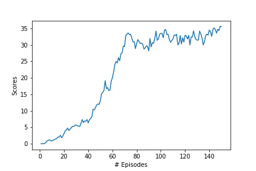

Author: [Fares El Kahla](https://github.com/faresbkh) 

The aim of this project is to explore the application of the Deep Deterministic Policy Gradient (DDPG) algorithm in the context of Reinforcement Learning (RL). Specifically, we will focus on using DDPG to learn an optimal policy for controlling 20 agents in the Reacher Unity environment. This environment involves a continuous state space and requires the agents to move their arm to reach a moving target. The agents have a continuous action space which consists of four dimensions representing the torque applied to the arm's two joints.

DDPG is a type of actor-critic method in RL that has been successfully used in many challenging control problems. By using two neural networks, one for the actor and one for the critic, DDPG is able to learn a continuous policy from raw sensory inputs. In this project, we aim to demonstrate the ability of DDPG to learn a suitable policy in the Reacher Unity environment.

This report provides an overview of the implementation of DDPG on the Reacher Unity environment, including details on the design and architecture of the algorithm, as well as a discussion of the results obtained. The report concludes with some reflections on the strengths and limitations of the method, as well as suggestions for future work.

The following report is written in four parts:

- **Implementation**
- **Results**
- **HyperParameters**
- **Ideas for improvement** 

## Implementation

Initially, DDPG did not provide good results when trained with a single agent because it suffered from instability and non-convergence issues. One of the main reasons for this was that the learning process was highly dependent on the hyperparameters used and it was challenging to find the right set of hyperparameters to achieve good results consistently.

However when trained with multiple agents simultaneously, the performance of DDPG significantly improved. In particular, when trained with 20 agents, DDPG was able to achieve much better convergence and stability in the learning process. This improvement is attributed to several factors, such as the increased exploration capability of multiple agents and the ability to learn from the experiences of other agents.

Beside the tuning of the number of agents, a tuning was performed on the Networks, by increasing the number of neurons in each hidden layer and adding dropout layers (then removing them), adding batch normalisation and even concatinating the state action in the hidden layers of the critic model to prevent the loss of the information in the forward pass on the model, also the buffer size impacted greately the convergence, the learning rate of the critic needed to be higher than the actor otherwise no convergence was found.

The Ornstein-Uhlenbeck process was also added. The process added a small amount of noise to the selected action at each time step, which helped to explore the state space more effectively and prevent the agent from getting stuck in a suboptimal policy.

It was challenging to fit the model as the training time was high and from the first itterations you can't detect wether it would converge or not

  ### Hyperparameters

  There were many hyperparameters involved in the experiment. The value of each of them is given below:

  | Hyperparameter                      | Value |
  | ----------------------------------- | ----- |
  | Replay buffer size                  | 1e6   |
  | Batch size                          | 256   |
  | $\gamma$ (discount factor)          | 0.99  |
  | $\tau$                              | 1e-3  |
  | Learning rate actor                 | 1e-4  |
  | Learning rate critic                | 1e-3  |
  | Number of episodes                  | 1000  |
  | Max number of timesteps per episode | 1000  |
  | Activation function                 | relu  |
  | Hidden layers actor                 |   2   |
  | Hidden layers units actor           |  256  |
  | Hidden layers units actor           |  128  |
  | Hidden layers critic                |   3   |
  | Hidden layers units critic          |  512  |
  | Hidden layers units critic          |  256  |
  | Hidden layers units critic          |  128  |

 ### Results
The model achieved +30 average score over 100 episodes in 144 episodes

|  DDPG |
| --------------------------------------------------- |
|  

### Ideas for improvement

* Prioritized Experience Replay: Similar to the DQN algorithm, the DDPG algorithm can also benefit from prioritized experience replay. Prioritizing experiences that are more important for learning can help the agent to learn more efficiently and achieve better performance. This can be achieved by prioritizing experiences based on their TD error or other measures of their importance.

* Hyperparameter Tuning: The performance of the DDPG algorithm can be highly dependent on the values of its hyperparameters. Experimenting with different values of hyperparameters, such as the learning rate, discount factor, and noise parameters, can help to find the optimal values for the Reacher environment with 20 agents.